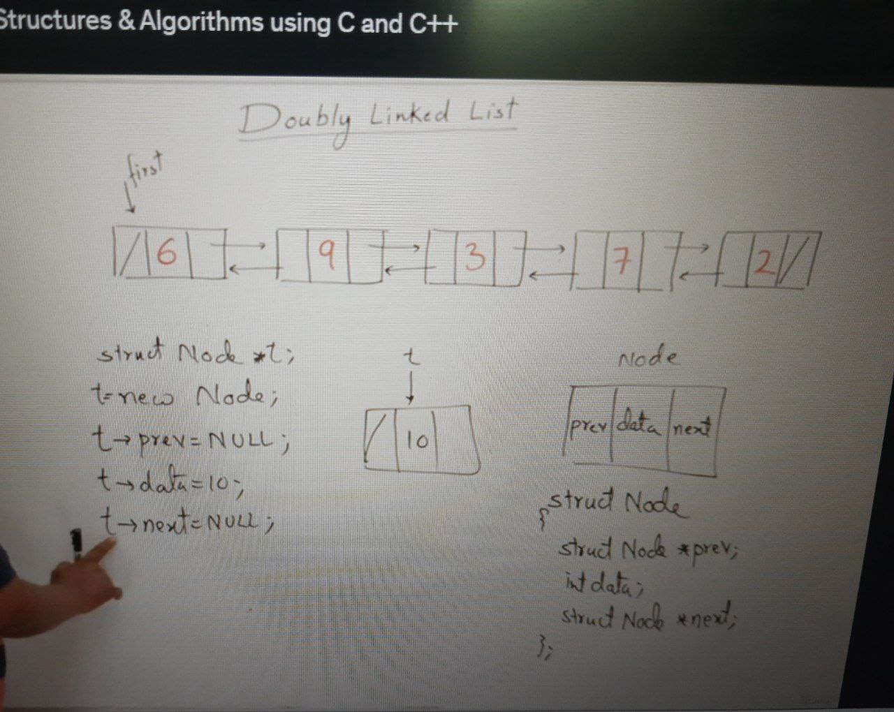
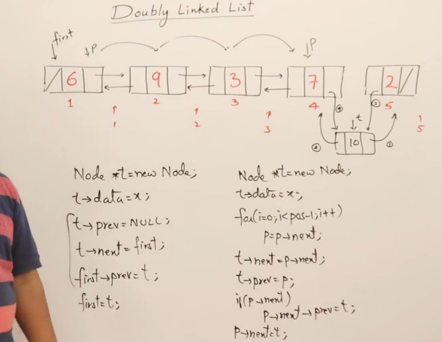

# Data Structures and Algorithms (DSA)

This repository contains a collection of data structures and algorithms implemented in various programming languages. It serves as a reference and learning resource for me.

## Table of Contents

1. [Data Structures](#data-structures)
   - [Array](#array)
   - [Linked List](#linked-list)
   - [Stack](#stack)
   - [Queue](#queue)
   - [Tree](#tree)
   - [Graph](#graph)
   - [Hash Table](#hash-table)
   - [Heap](#heap)
   - [Others](#other-data-structures)
2. [Algorithms](#algorithms)
   - [Sorting](#sorting-algorithms)
   - [Searching](#searching-algorithms)
   - [Dynamic Programming](#dynamic-programming)
   - [Graph Algorithms](#graph-algorithms)
   - [Greedy Algorithms](#greedy-algorithms)
   - [String Algorithms](#string-algorithms)
   - [Other Algorithms](#other-algorithms)

# Data Structures

## Array

Placeholder for documentation on arrays.

## Linked List

---

### Checking if a Linked List is Sorted

### Algorithm

The algorithm works as follows:

1. Initialize a variable `x` to `INT_MIN` (the minimum possible integer value).
2. Start from the first node of the linked list.
3. Iterate through the linked list.
4. For each node, compare its data with the value stored in `x`.
5. If the node's data is less than `x`, the linked list is considered unsorted, and the algorithm returns `false`.
6. Update `x` with the current node's data and move to the next node.
7. If the algorithm completes the traversal without detecting an unsorted element, it returns `true`, indicating that the linked list is sorted.

### Pseudocode

```c
int x = INT_MIN;  // Initialize to the minimum possible integer value
Node *p = first;  // Start from the first node

while (p != NULL) {
    if (p->data < x) {
        return false;  // Linked list is unsorted
    }
    x = p->data;     // Update x with the current node's data
    p = p->next;     // Move to the next node
}

return true;  // Linked list is sorted
```

---

## Deleting Nodes in a Linked List

In this document, we'll discuss how to delete nodes from a linked list, both when deleting the first node and when deleting from any other node.

### Deleting the First Node from Linked List

To delete the first node of a linked list, follow these steps:

1. Create a new pointer `p` for deleting the first node.
2. Move the `first` pointer to the next node to maintain the list structure.
3. Delete the first node using the `p` pointer. Deleting with `p` is essential because deleting with `first` would cause a loss of the address of the next node.

**Code:**

```cpp
Node *p = first;
first = first->next;
x = p->data;
delete p; // Time Complexity: O(1)
```

## Deleting from Any Other Node

When you want to delete a node from a position other than the first node, follow these steps:

1. Let's say you want to delete the node at position `pos` (e.g., 4th node).
2. Ensure that the `(pos-1)`-th node points to the `(pos+1)`-th node.
3. Use two pointers, `p` and `q`, where `p` follows `q`.
4. Iterate through the linked list, moving `p` and `q` forward until `p` is on the node to be deleted (e.g., the 4th node), and `q` is on the previous node (e.g., the 3rd node).
5. Code handles any position `k` by moving `(k-1)` times.

**Code:**

```cpp
Node *p = first;
Node *q = NULL;
for (i = 0; i < pos - 1; i++)
{
    q = p;
    p = p->next;
}
q->next = p->next; // (pos-1)-th node points to (pos+1)-th node
x = p->data;       // Retrieve data from the node to be deleted
delete p;
```

### Full Function Example

```c
int Delete(struct Node *p, int index)
{
    struct Node *q = NULL;
    int x = -1, i;

    if (index < 1 || index > count(p))
        return -1;

    if (index == 1)
    {
        q = first;
        x = first->data;
        first = first->next;
        free(q);
        return x;
    }
    else
    {
        for (i = 0; i < index - 1; i++)
        {
            q = p;
            p = p->next;
        }
        q->next = p->next;
        x = p->data;
        free(p);
        return x;
    }
}
```

The `Delete` function can be used to delete a node at a specified index in the linked list.

---

### Removing Duplicate Elements from a Linked List

In this section, we'll discuss how to remove duplicate elements from a linked list. The following method assumes that the linked list is already sorted.

#### Method Overview

1. Initialize two pointers, `p` and `q`, where `p` points to the first node, and `q` points to the next node.
2. Compare the data in nodes pointed to by `p` and `q`. If they do not match, move `p` to `q`, and move `q` to the next node.
3. If the data in nodes pointed to by `p` and `q` match, it indicates a duplicate element.
   - Update `p` to point to `q->next`, effectively skipping the duplicate node.
   - Delete the duplicate node pointed to by `q`.
   - Move `q` to `p->next` to continue the comparison.
4. Repeat steps 2 and 3 until the end of the linked list (`q` becomes `NULL`).

#### Code Implementation

```cpp
Node *p = first;
Node *q = first->next;

while (q != NULL)
{
    if (p->data != q->data)
    {
        p = q;
        q = q->next;
    }
    else
    {
        p->next = q->next;
        delete q;
        q = p->next;
    }
}
```

#### Time Complexity

The time complexity of this algorithm is O(n) because it always traverses the entire linked list once.

#### Full Function Example

You can also implement the `RemoveDuplicate` function as follows:

```c
void RemoveDuplicate(struct Node *p)
{
    struct Node *q = p->next;

    while (q != NULL)
    {
        if (p->data != q->data)
        {
            p = q;
            q = q->next;
        }
        else
        {
            p->next = q->next;
            free(q);
            q = p->next;
        }
    }
}
```

The `RemoveDuplicate` function takes the first node of the linked list as its argument and removes duplicates in place.

---

### Reversing a Linked List

In this document, we will explore different methods to reverse a linked list. Reversing a linked list changes the order of elements in the list, making the last element the new first element and vice versa.

#### Reversing by Reversing Elements

To reverse a linked list by reversing its elements, follow these steps:

1. Traverse the linked list using a pointer `p` and copy the elements into a new array `A`.
2. Reset the `p` pointer to the first node of the linked list.
3. Use an index `i` and iterate from the end of the array `A` to the beginning.
4. Copy `A[i]` to the current `p` node's data, move `p` to the next node, and decrement `i`.
5. Repeat step 4 until you've updated all elements in the linked list.

**Code:** (Time Complexity: O(n))

```c
p = first;
i = 0;
while (p != NULL)
{
    A[i] = p->data;
    p = p->next;
    i++;
}
p = first;
i--;
while (p != NULL)
{
    p->data = A[i--];
    p = p->next;
}
```

### Reversing by Reversing Links

To reverse a linked list by reversing its links, follow these steps:

1. Initialize three pointers: `p`, `q`, and `r`, and set `p` to the `first` node, `q` to `NULL`, and `r` to `NULL`.
2. While `p` is not `NULL`, continue the following steps:
   - Set `r` to `q`.
   - Set `q` to `p`.
   - Move `p` to the next node.
   - Update `q`'s `next` to point to `r`.
3. After the loop, set `first` to `q` to make the last element the new first element.

**Code:**

```c
p = first;
q = NULL;
r = NULL;
while (p != NULL)
{
    r = q;
    q = p;
    p = p->next;
    q->next = r;
}
first = q;
```

### Reversing by Using Recursion

To reverse a linked list using recursion, follow these steps:

1. Create a recursive function `Reverse` that takes two pointers, `q` trailing `p`, as arguments.
2. In the `Reverse` function, check if `p` is not `NULL`.
3. If `p` is not `NULL`, recursively call `Reverse` with `p` as the new `q` and `p->next` as the new `p`.
4. During the return phase of the recursion, set `p->next` to `q`.
5. Finally, when the recursion ends, set `first` to `q` to make the last element the new first element.

**Code:**

```c
void Reverse(node *q, node *p)
{
    if (p != NULL)
    {
        Reverse(p, p->next);
        p->next = q;
    }
    else
    {
        first = q;
    }
}
```

---

#### Concatenation of Linked Lists

Concatenation of linked lists involves combining two linked lists by appending one to the end of the other. This process is useful when you want to extend the first linked list with the elements of the second linked list.

To concatenate two linked lists, follow these steps:

1. Traverse the first linked list using a pointer `p` until you reach the last node. The last node is identified by `p->next` being `NULL`.
2. Once you reach the last node of the first linked list, set `p->next` to point to the head of the second linked list (let's call it `second`).

**Code:**

```c
p = first;
while (p->next != NULL)
{
    p = p->next;
}
p->next = second; // Time Complexity: O(n)
```

---

#### Merging Linked Lists

Merging linked lists involves combining two sorted lists into a single sorted list. This process is commonly used when you have two separate sorted linked lists, and you want to merge them into a single sorted linked list.

To merge two sorted linked lists, follow these steps:

- Create two pointers, `third` and `last`, to keep track of the merged list and the last node of the merged list, respectively.

- Compare the first node of the first linked list (1st LL) and the first node of the second linked list (2nd LL).

- Whichever node has the smaller value, move the `third` and `last` pointers to it. Then, move the `first` pointer to the next node and make the previous one null.

**Code:** (Time Complexity: O(m + n) where 'm' and 'n' are the lengths of the two linked lists)

```c
if (first->data < second->data)
{
    third = last = first;
    first = first->next;
    last->next = NULL;
}
else
{
    third = last = second;
    second = second->next;
    last->next = NULL;
}

while (first != NULL && second != NULL)
{
    if (first->data < second->data)
    {
        last->next = first;
        last = first;
        first = first->next;
        last->next = NULL;
    }
    else
    {
        last->next = second;
        last = second;
        second = second->next;
        last->next = NULL;
    }
}

if (first != NULL)
    last->next = first;
else
    last->next = second;
```

In this code, we start by comparing the first nodes of the two linked lists (`first` and `second`). We determine which node has the smaller value and make `third` and `last` point to it. Then, we move the respective pointer (`first` or `second`) to the next node and update the `last` pointer accordingly. We continue this process until we reach the end of one of the linked lists.

Finally, we check if there are any remaining nodes in either linked list and append them to the merged list. The result is a single sorted linked list containing all the elements from both input linked lists.

This operation has a time complexity of O(m + n) where 'm' and 'n' are the lengths of the two linked lists being merged. // O(n)

---

#### Detecting if a Linked List is a Loop

Detecting whether a linked list contains a loop is a common problem in computer science. A loop in a linked list occurs when a node points to a previous node, creating a cycle within the list. Detecting such loops is crucial to avoid infinite loops in algorithms that traverse linked lists.

#### Approach

A straightforward approach to detect a loop in a linked list is to use two pointers. One pointer moves one node at a time, while the other moves two nodes at a time. If the linked list contains a loop, the faster-moving pointer will eventually catch up to the slower-moving pointer, confirming the presence of a loop.

#### Implementation

Here's a C++ implementation of the loop detection algorithm:

```cpp
int isLoop(Node *first)
{
    Node *slowPtr, *fastPtr;
    slowPtr = fastPtr = first;

    // Traverse the linked list with two pointers
    while (slowPtr && fastPtr && fastPtr->next)
    {
        slowPtr = slowPtr->next;        // Move one node at a time
        fastPtr = fastPtr->next->next;  // Move two nodes at a time

        // If the two pointers meet, there is a loop
        if (slowPtr == fastPtr)
        {
            return true;
        }
    }

    // If no loop is found, return false
    return false;
}
```

The `isLoop` function uses the two-pointer approach to detect a loop in a linked list. If a loop is found, it returns `true`; otherwise, it returns `false`. The time complexity of this algorithm is O(n), where n is the number of nodes in the linked list.

By using this algorithm, you can efficiently determine whether a linked list contains a loop and take appropriate actions in your programs.

---

#### Circular Linked List

A circular linked list is a type of linked list in which the last node of the list points back to the first node, creating a loop. This circular structure allows for efficient traversal of the entire list, as well as various applications, such as representing tasks in scheduling algorithms or managing resources in a circular buffer.

#### Key Characteristics

- Circular linked lists are similar to singly linked lists but with the last node pointing back to the first node.
- The traversal of a circular linked list can start from any node, as the loop structure ensures that you can reach all nodes in the list.
- Circular linked lists are useful in scenarios where you need continuous access to data elements in a loop.

#### Displaying Elements in a Circular Linked List

To display elements in a circular linked list, you can start at any node and continue traversing the list until you reach the starting node again. Here's a C++ function that demonstrates how to display elements in a circular linked list:

```cpp
void Display(Node *head)
{
    Node *current = head;

    do {
        cout << current->data << " ";
        current = current->next;
    } while (current != head);
}

// Example usage:
// Display(head);
```

The `Display` function takes the `head` pointer of the circular linked list as an argument. It uses a `do-while` loop to traverse the list, printing the data of each node. The loop continues until the current node is equal to the `head` node, ensuring that all elements are displayed.

By implementing and using circular linked lists, you can efficiently manage and manipulate data structures that require cyclic access or periodic processing.

---

### Inserting in a Circular Linked List

Inserting nodes into a circular linked list involves adding new elements at specific positions within the list. Circular linked lists have no actual "end," so they loop back to the beginning. This type of list is useful for scenarios where elements need to be continuously processed.

#### Inserting at Any Other Position

To insert a new node at any position other than the head, follow these steps:

1. Create a new node `t` to be inserted.
2. Choose the desired position, and traverse the list using a pointer `p` until you reach the node just before the desired position.
3. Set `t->next` to point to `p->next`.
4. Update `p->next` to point to `t`.

**Code:** (Time Complexity: O(1) if inserted after the head, otherwise O(n))

```cpp
Node *t;
Node *p = head;
for (i = 0; i < pos - 1; i++)
    p = p->next;

t = new Node;
t->data = x;
t->next = p->next;
p->next = t;
```

#### Inserting Before the Head Node

To insert a new node before the head node, follow these steps:

1. Create a new node `t` to be inserted.
2. Make the last node in the list point to `t`.
3. Traverse the list from the head node using a pointer `p` until you find the node whose `next` points to the head node.
4. Set `t->next` to point to the head node.
5. Update the last node's `next` to point to `t`.
6. Finally, set the `head` pointer to `t`.

**Code:**

```cpp
Node *p = head;
Node *t = new Node;
t->data = x;
t->next = head;

while (p->next != head)
{
    p = p->next;
}
p->next = t;
head = t;
```

#### Full Code Example

Here's a full example of inserting nodes into a circular linked list:

```cpp
int Length(struct Node *p)
{
    int len = 0;
    do {
        len++;
        p = p->next;
    } while (p != Head);
    return len;
}

void Insert(struct Node *p, int index, int x)
{
    struct Node *t;
    int i;

    if (index < 0 || index > Length())
        return;

    if (index == 0) {
        t = new Node;
        t->data = x;
        if (Head == NULL) {
            Head = t;
            Head->next = Head;
        } else {
            while (p->next != Head)
                p = p->next;
            p->next = t;
            t->next = Head;
            Head = t;
        }
    } else {
        for (i = 0; i < index - 1; i++)
            p = p->next;
        t = new Node;
        t->data = x;
        t->next = p->next;
        p->next = t;
    }
}
```

---

#### Deleting a Node from a Circular Linked List

Deleting a node from a circular linked list involves adjusting the pointers to maintain the circular structure while removing the desired node. This process can be divided into two scenarios: deleting a node from a given position and deleting the head node.

#### Deleting from a Given Position

To delete a node from a given position in a circular linked list, follow these steps:

1. Traverse the list and bring the pointer `p` to the node just before the node to be deleted.
2. Take a pointer `q` that points to the node to be deleted.
3. Update the `next` pointer of `p` to point to the node following `q`.
4. Retrieve the data from node `q` into a variable `x`.
5. Delete the node `q`.

**Code:**

```cpp
p = head;
for (i = 0; i < pos - 2; i++)
{
    p = p->next;
}
q = p->next;
p->next = q->next;
x = q->data;
delete q;
```

#### Deleting the Head Node

To delete the head node of a circular linked list, follow these steps:

1. Take a pointer `p` and traverse the list until you reach the last node.
2. Ensure that the last node's `next` pointer points to the new head (the node following the current head).
3. Retrieve the data from the head node into a variable `x`.
4. Delete the head node.
5. Update the `head` pointer to point to the new head.

**Code:**

```cpp
p = head;
while (p->next != head)
    p = p->next;
p->next = head->next;
x = head->data;
delete head;
head = p->next;
```

---

Certainly! Here's a markdown document explaining doubly linked lists using `###` for subheadings:

### Doubly Linked List

A doubly linked list is a data structure that consists of a sequence of nodes. Each node contains data and two pointers, one pointing to the previous node (if any) and another pointing to the next node (if any). This structure allows for efficient traversal in both directions, unlike a singly linked list, which only supports one-way traversal.

#### Node Structure

In a doubly linked list, each node typically contains the following components:

```cpp
struct Node {
    int data;
    Node* prev;
    Node* next;
};
```

- `data`: The value or data stored in the node.
- `prev`: A pointer to the previous node in the list (or `NULL` if there is no previous node).
- `next`: A pointer to the next node in the list (or `NULL` if there is no next node).

#### Advantages of Doubly Linked Lists

1. **Bidirectional Traversal**: Doubly linked lists allow for efficient traversal in both forward and backward directions. This is especially useful in scenarios where you need to navigate the list in reverse order.

2. **Insertions and Deletions**: Insertions and deletions can be performed more efficiently compared to singly linked lists. You can easily insert or delete a node without needing to traverse the list from the beginning.

3. **Implementation of Data Structures**: Doubly linked lists are used as building blocks for more complex data structures like stacks, queues, and hash tables.

#### Operations on Doubly Linked Lists

##### 1. Insertion

- **Insertion at the Beginning**: Inserting a node at the beginning of the list is a constant time operation (O(1)).

- **Insertion at the End**: Inserting a node at the end of the list is a linear time operation (O(n)), as you need to traverse the entire list to find the last node.

- **Insertion at a Specific Position**: Inserting a node at a specific position involves updating the pointers of neighboring nodes. It can be done in O(n/2) time on average.

##### 2. Deletion

- **Deletion of a Node**: Deleting a node from a doubly linked list can be done in constant time (O(1)) if you have a reference to the node to be deleted.

##### 3. Traversal

- **Forward Traversal**: Traverse the list from the head (first) node to the tail (last) node using the `next` pointers.

- **Backward Traversal**: Traverse the list in reverse order, from the tail node to the head node, using the `prev` pointers.

#### Use Cases

Doubly linked lists are commonly used when you need efficient bidirectional traversal or when insertions and deletions in the middle of the list are frequent. They are also used in implementing more advanced data structures, like LRU (Least Recently Used) caches.

#### Limitations

- Doubly linked lists consume slightly more memory compared to singly linked lists because of the extra `prev` pointers.

- Implementing and maintaining doubly linked lists can be more complex due to the need to manage both forward and backward pointers.

Doubly linked lists are a valuable tool in data structure design and are well-suited for specific scenarios where bidirectional traversal and efficient insertions/deletions are required.



---

#### Inserting in a Doubly Linked List



Inserting a node into a doubly linked list involves creating a new node, adjusting the pointers of neighboring nodes, and maintaining the links between nodes.

#### Inserting Before the 1st Node

To insert a node before the first node in a doubly linked list, follow these steps:

1. Create a new node `t` and set its data value.
2. Set the `prev` pointer of `t` to `NULL` because it will be the new first node.
3. Set the `next` pointer of `t` to point to the current first node.
4. Update the `prev` pointer of the current first node to point to `t`.
5. Update the `first` pointer to point to the new first node `t`.

**Code:**

```cpp
Node *t = new Node;
t->data = x;
t->prev = NULL;
t->next = first;
first->prev = t;
first = t;
```

This operation takes constant time for most cases (minimum O(1)), but in the worst case (when inserting at the beginning), it can take linear time O(n), where 'n' is the number of nodes in the list.

#### Inserting at Any Position

To insert a node at any position (e.g., 4th position) in a doubly linked list, follow these steps:

1. Create a new node `t` and set its data value.
2. Update the pointers of four nodes to insert `t` between the 4th and 5th nodes:
   - Set the `prev` pointer of `t` to point to the 4th node.
   - Set the `next` pointer of `t` to point to the 5th node.
   - Update the `next` pointer of the 4th node to point to `t`.
   - Update the `prev` pointer of the 5th node to point to `t`.
3. Your list now includes the newly inserted node `t`.

**Code:** (Similar to above, see code above)

---

### Deleting Doubly Linked List

Deleting a node from a doubly linked list involves adjusting the pointers correctly to remove the desired node. This can be done for the first node or any given node within the list.

#### Deleting the First Node

To delete the first node in a doubly linked list, follow these steps:

1. Take a pointer `p` and set it to the first node.
2. Move the `first` pointer to the next node.
3. Retrieve the value of `p` (which is the data of the first node).
4. Delete the node pointed to by `p`.
5. Set `first->prev` to `NULL` to disconnect it from the previous node (if any).

**Code:**

```cpp
p = first;
first = first->next;
x = p->data;
delete p;
if (first)
    first->prev = NULL;
```

#### Deleting from a Given Node

To delete a node from a specific position (e.g., the 4th node) in a doubly linked list, follow these steps:

1. Bring a pointer `p` from the `first` pointer to the 4th node.
2. Update the `next` pointer of `p->prev` to point to `p->next`.
3. Update the `prev` pointer of `p->next` to point to `p->prev`.
4. Retrieve the data from node `p` into a variable `x`.
5. Delete the node `p`.

**Code:**

```cpp
p = first;
for (i = 0; i < pos - 1; i++)
    p = p->next;
p->prev->next = p->next;
if (p->next)
    p->next->prev = p->prev;
x = p->data;
delete p;
```

This deletion operation takes constant time O(1) in the best and average cases and linear time O(n) in the worst case.

---

### Reversing a Doubly Linked List

Reversing a doubly linked list changes the order of nodes, making the last node the new first node and vice versa.

To reverse a doubly linked list, follow these steps:

1. Take a pointer `p` and set it to `first`.
2. For each node in the list:
   - Swap the `prev` and `next` pointers of the current node `p`.
   - Move `p` to its previous node.

**Code:**

```cpp
p = first;
while (p) {
    temp = p->next;
    p->next = p->prev;
    p->prev = temp;
    p = p->prev;

    if (!p->next)
        first = p;
}
```

---

### Circular Doubly Linked List

A circular doubly linked list is a data structure where the last node's `next` pointer points to the first node, creating a loop. This structure allows bidirectional traversal and constant-time insertions before the head node.

#### Code Example

Here's a C++ code example demonstrating the creation, display, and deletion of nodes in a circular doubly linked list.

```cpp
#include <iostream>

// Node structure
struct Node {
    int data;
    Node* next;
    Node* prev;
};

// Display the circular doubly linked list
void display(Node* head) {
    if (!head) return;
    Node* current = head;
    do {
        std::cout << current->data << " ";
        current = current->next;
    } while (current != head);
    std::cout << std::endl;
}

// Insert a new node after a given node
void insert_after(Node* prev_node, int data_to_insert) {
    if (!prev_node) return;
    Node* new_node = new Node;
    new_node->data = data_to_insert;
    new_node->next = prev_node->next;
    prev_node->next = new_node;
    new_node->prev = prev_node;
    new_node->next->prev = new_node;
}

// Insert a new node before the head node (constant time)
Node* insert_before_head(Node* head, int data_to_insert) {
    Node* new_node = new Node;
    new_node->data = data_to_insert;
    if (!head) {
        new_node->next = new_node;
        new_node->prev = new_node;
        return new_node;
    }
    Node* last_node = head->prev;
    new_node->next = head;
    new_node->prev = last_node;
    head->prev = new_node;
    last_node->next = new_node;
    return new_node; // Return new head if needed
}

// Delete a node (constant time)
void delete_node(Node* node_to_delete) {
    if (!node_to_delete) return;
    node_to_delete->prev->next = node_to_delete->next;
    node_to_delete->next->prev = node_to_delete->prev;
    delete node_to_delete;
}

int main() {
    Node* head = nullptr; // Initialize an empty list

    // Insert nodes
    head = insert_before_head(head, 3); // Insert before head


    insert_after(head, 5);
    insert_after(head->next, 7);

    // Display the list
    display(head); // Output: 3 5 7

    // Delete a node
    delete_node(head->next);
    display(head); // Output: 3 7

    return 0;
}
```

---

### Polynomial Representation with Doubly Linked List

Polynomials can be represented using a doubly linked list, with each node storing the coefficient and exponent of a term. Here's a C++ code example for creating, displaying, and evaluating polynomials using a doubly linked list.

#### Code Example

```cpp
#include <iostream>
#include <cmath>

class Node {
public:
    int coeff;
    int exp;
    Node* next;

    Node(int c, int e) : coeff(c), exp(e), next(nullptr) {}
};

class Polynomial {
private:
    Node* poly;

public:
    Polynomial() : poly(nullptr) {}

    void create() {
        Node* t = nullptr;
        Node* last = nullptr;
        int num, coeff, exp;

        std::cout << "Enter number of terms: ";
        std::cin >> num;
        std::cout << "Enter each term with coeff and exp:" << std::endl;

        for (int i = 0; i < num; i++) {
            std::cin >> coeff >> exp;
            t = new Node(coeff, exp);
            t->next = nullptr;

            if (!poly) {
                poly = last = t;
            } else {
                last->next = t;
                last = t;
            }
        }
    }

    void display() {
        Node* p = poly;

        while (p) {
            std::cout << p->coeff << "x^" << p->exp;
            if (p->next) {
                std::cout << " + ";
            }
            p = p->next;
        }
        std::cout << std::endl;
    }

    long evaluate(int x) {
        long val = 0;
        Node* p = poly;

        while (p) {
            val += p->coeff * std::pow(x, p->exp);
            p = p->next;
        }

        return val;
    }
};

int main() {
    Polynomial poly;
    poly.create();
    poly.display();
    std::cout << poly.evaluate(1) << std::endl;

    return 0;
}
```

This code defines a `Polynomial` class that uses a doubly linked list to represent and work with polynomial expressions.

---

## Stack

Certainly! Below is a Markdown document explaining the principles, abstract data type (ADT), and implementations of a stack data structure, including code examples in C++ for stack implementation using an array and a linked list.

````markdown
### Stack Data Structure

A stack is a fundamental data structure that follows the Last-In, First-Out (LIFO) principle. In a stack, the most recently added item is the first one to be removed. It is a versatile data structure used in various computer science applications.

#### Abstract Data Type (ADT) Stack

An ADT stack consists of the following components:

- **Space**: A space for storing elements.
- **Top Pointer**: A pointer that points to the topmost element of the stack.

#### Operations

The stack supports the following operations:

- `push()`: Adds an element to the top of the stack.
- `pop()`: Removes and returns the top element from the stack.
- `peek(index)`: Retrieves the element at a specific index from the top of the stack.
- `stackTop()`: Returns the topmost element without removing it.
- `isEmpty()`: Checks if the stack is empty.
- `isFull()`: Checks if the stack is full (for array-based implementations).

### Implementation of Stack Using Array

#### Code Example

```cpp
struct Stack {
    int size;
    int top;
    int* s;
};

int main() {
    struct Stack st;
    cout << "Enter the size of the stack: ";
    cin >> st.size;
    st.s = new int[st.size];
    st.top = -1;

    // Perform stack operations here

    delete[] st.s; // Don't forget to free the memory
    return 0;
}
```
````

### Implementation of Stack Using Linked List

For a detailed implementation of a stack using a linked list, you can refer to the following resource:
[Stack Implementation Using Linked List](https://www.udemy.com/course/datastructurescncpp/learn/lecture/13145332#notes)

This resource provides a step-by-step explanation and code examples for implementing a stack using a linked list.

---

### Parenthesis Matching using Stack

In this example, we will implement parenthesis matching using a stack data structure. We will explore two approaches: one using a custom stack implementation and another using the C++ standard library stack.

#### Custom Stack Implementation

We'll start with a custom stack implementation in C++ to check for balanced parentheses in an expression.

### Stack Class

We create a `Stack` class with the following methods:

- `push(char x)`: Pushes a character onto the stack.
- `pop()`: Pops and returns the top character from the stack.
- `peek(int index)`: Retrieves the character at a specific index from the top of the stack.
- `isFull()`: Checks if the stack is full.
- `isEmpty()`: Checks if the stack is empty.
- `display()`: Displays the elements of the stack.
- `stackTop()`: Returns the top character without removing it.

```cpp
#include <iostream>
#include <cstring>
using namespace std;

class Stack {
private:
    int size;
    int top;
    char* S;
public:
    Stack(int size);
    ~Stack();
    void push(char x);
    char pop();
    char peek(int index);
    int isFull();
    int isEmpty();
    void display();
    char stackTop();
};

// Implementation of methods
// ...

int main() {
    // Testing the isBalanced function
    char E[] = "((a+b)*(c-d))";
    cout << isBalanced(E) << endl;

    char F[] = "((a+b)*(c-d)))";
    cout << isBalanced(F) << endl;

    char G[] = "(((a+b)*(c-d))";
    cout << isBalanced(G) << endl;
    return 0;
}
```

### isBalanced Function

The `isBalanced` function uses the custom stack to check if an expression has balanced parentheses. It scans the input expression and pushes '(' onto the stack when '(' is encountered. When ')', it pops '(' from the stack if available. If the stack is empty when encountering ')', the expression is unbalanced.

### Output

The output of the `isBalanced` function indicates whether the given expressions have balanced parentheses.

### Extended Problem

We can also solve the problem using the C++ standard library stack and a mapping of closing and opening parentheses. This approach offers a more concise solution.

```cpp
#include <iostream>
#include <cstring>
#include <stack>
#include <map>

using namespace std;

int isBalanced(char* exp) {
    // Create a map to store closing and opening parentheses pairs
    map<char, char> mapping;
    mapping['}'] = '{';
    mapping[')'] = '(';
    mapping[']'] = '[';

    // Create a stack using the C++ standard library
    stack<char> stk;

    for (int i = 0; i < strlen(exp); i++) {
        if (exp[i] == '{' || exp[i] == '[' || exp[i] == '(') {
            stk.push(exp[i]);
        } else if (exp[i] == '}' || exp[i] == ']' || exp[i] == ')') {
            if (stk.empty()) {
                return false;
            } else {
                char temp = stk.top();
                // Check if the current character closes the corresponding opening parenthesis
                if (temp == mapping[exp[i]]) {
                    stk.pop();
                } else {
                    return false;
                }
            }
        }
    }
    return stk.empty() ? true : false;
}

int main() {
    char A[] = "{([a+b]*[c-d])/e}";
    cout << isBalanced(A) << endl;

    char B[] = "{([a+b]}*[c-d])/e}";
    cout << isBalanced(B) << endl;

    char C[] = "{([{a+b]*[c-d])/e}";
    cout << isBalanced(C) << endl;

    return 0;
}
```

---

### Queue

Placeholder for documentation on queues.

### Tree

Placeholder for documentation on trees.

### Graph

Placeholder for documentation on graphs.

### Hash Table

Placeholder for documentation on hash tables.

### Heap

Placeholder for documentation on heaps.

### Other Data Structures

Placeholder for other data structures not listed above.

## Algorithms

### Sorting Algorithms

Placeholder for documentation on sorting algorithms.

### Searching Algorithms

Placeholder for documentation on searching algorithms.

### Dynamic Programming

Placeholder for documentation on dynamic programming.

### Graph Algorithms

Placeholder for documentation on graph algorithms.

### Greedy Algorithms

Placeholder for documentation on greedy algorithms.

### String Algorithms

Placeholder for documentation on string algorithms.

### Other Algorithms

Placeholder for other algorithms not listed above.
